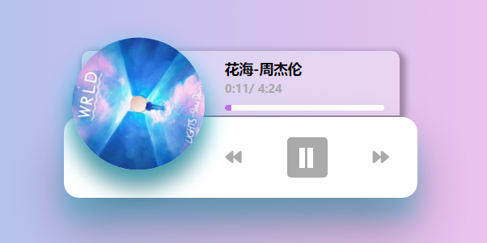
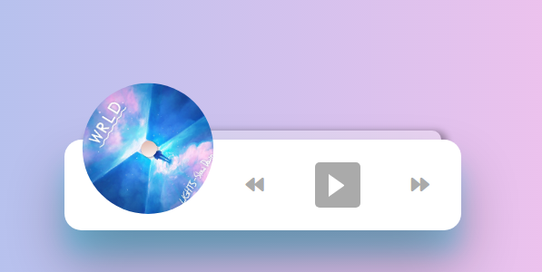

# Music-Player

> This music-player is based on Vue.
>
> Product Design:https://dribbble.com/shots/4240318-Made-with-InVision-Studio-Music-Player


## Project View

> #### Playing State:
>
> 

> #### Pasued State:
>
> 

## Project setup

```
npm install
```

## Compiles and hot-reloads for development
```
npm run serve
```

## Customize configuration
See [Configuration Reference](https://cli.vuejs.org/config/).
